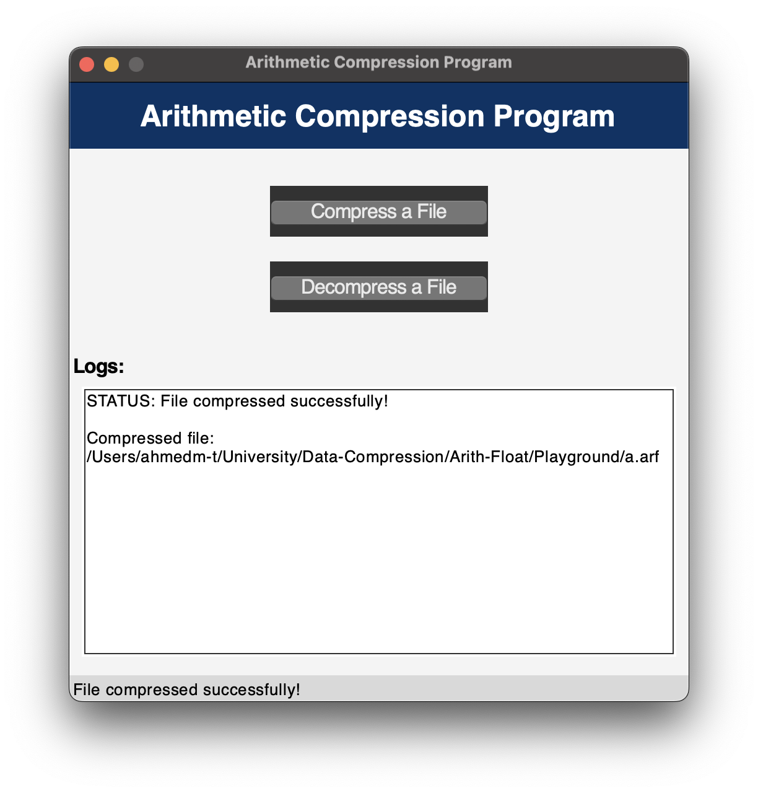

# Arithmetic Compression and Decompression Program

📄 Simple tool for compressing and decompressing text files using **Arithmetic Coding**.

## Features 🌟

<table>
  <tr>
    <td>
      <ul>
        <li>🧠 <strong>Smart Compression:</strong> Uses Arithmetic Coding to shrink text files based on character frequency.</li>
        <li>📦 <strong>Decompression:</strong> Restores original files perfectly from <code>.arf</code> compressed files.</li>
        <li>🖼️ <strong>GUI Mode:</strong> Simple drag-and-drop interface using Tkinter.</li>
        <li>💻 <strong>CLI Mode:</strong> Terminal-based tool for quick compression & testing.</li>
        <li>📁 <strong>File Support:</strong> Works with any <code>.txt</code> files inside the <code>Playground/</code> folder.</li>
      </ul>
    </td>
     <td>
      
    </td>
  </tr>
</table>


## Installation ⬇️

1. Clone the repository:

   ```bash
   git clone https://github.com/AhmedMT3/Arithmetic-Float.git
   cd Arithmetic-Float
   ```

2. Set up a Python virtual environment (optional but recommended):

   ```bash
    # On Mac/Linux:
   python -m venv venv
   source ./venv/bin/activate
   # On Windows:
   myenv\Scripts\activate
   ```

3. Install required dependencies:

   ```bash
   pip install numpy pillow
   ```

---

## Usage

### GUI Mode 🎨 

Run the GUI application for an easy-to-use interface:

```bash
python GUI.py
```

#### Features in GUI:

- **Compress a File:** Select a text file and save it as a compressed `.arf` file.
- **Decompress a File:** Select a `.arf` file and reconstruct the original text file.

### Command-Line Mode 💻

Run the command-line interface:

```bash
python main.py
```

#### Options:

1. Compress a text file located in the `Playground/` folder.
2. Decompress a `.arf` file located in the `Playground/` folder.
3. Test the algorithm by compressing string data directly.

---

## Notes

- Ensure that all files for compression and decompression are placed in the `Playground/` directory.
- Compressed files have the `.arf` extension and contain all necessary metadata for decompression.
- GUI and CLI modes are independent; you can use either based on your preference.

---

## License

This project is licensed under the MIT License. See the [LICENSE file](LICENSE) for details.
